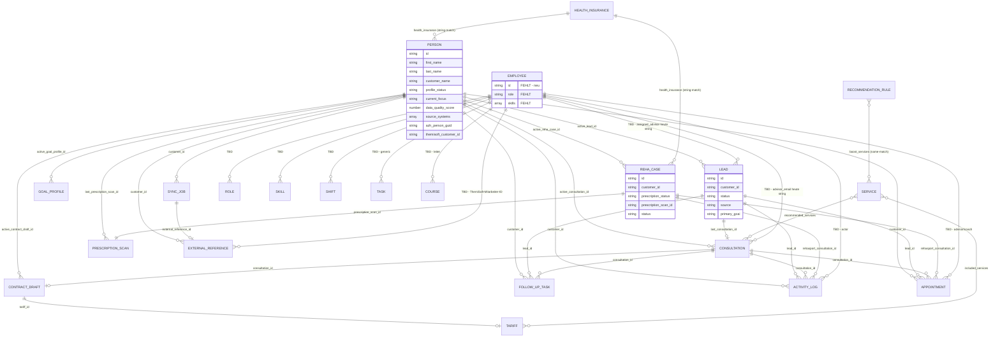

# AlbGym Nav — Datenmodell (Grob, Sprint 0)

Quelle: Direkt-Briefing (`docs/sprint-0/00-product-vision-raw.md`), aktueller Code in `base44/entities/*.jsonc` und `src/lib/*.js` zum Commit-Stand `cca650d` (main).
Zweck: gemeinsame Faktenbasis fuer Architecture-, Frontend- und Integrations-Agenten in Sprint 0. **Keine Codeaenderung in diesem Dokument.**

---

## 1. Zwei kanonische Identitaeten

### 1.1 Person (heute: Customer-Entity)
- Heute realisiert als `Customer` (`base44/entities/Customer.jsonc:1-307`, Source-of-Truth-Logik in `src/lib/customerDataModel.js`).
- `customer_status` (`Customer.jsonc:75-85`) und `profile_status` (`Customer.jsonc:101-113`) kennen u.a. `lead`, `mitglied`, `reha_aktiv` — d.h. Lead, Mitglied und Rehasportler sind bereits **EIN Datensatz mit Kontext**, nicht getrennte Personen. Das entspricht direkt Charter-Regel Nr. 1-3 (`00-product-vision-raw.md:137-141`).
- Person ist Anker fuer Lead, GoalProfile, Consultation, RehasportConsultation, ContractDraft, PrescriptionScan, SyncJob, ExternalReference, FollowUpTask, ActivityLog, Appointment (alle haben `customer_id` oder `customer_profile_id`).

**Begruendung Stabilitaet:**
- ID-Stabilitaet durch Identitaetsmatch in `findMatchingCustomers` (`customerDataModel.js:545-571`): Insurance-Number, E-Mail, Telefon, Name+Geburtsdatum.
- Eine Person kann gleichzeitig Lead, Reha-Kandidat und Mitglied sein — das ist im Modell durch parallele `active_*_id`-Pointer (`Customer.jsonc:135-162`) gedeckt.
- Charter-No-Gos 1-3 (`00-product-vision-raw.md:137-141`) verbieten explizit doppelte Personendatensaetze.

### 1.2 Mitarbeiter (Employee) — KRITISCHER GAP
- **Im Code nicht vorhanden.** Grep nach `employee|mitarbeiter` in `base44/entities/*.jsonc` liefert NUR Fundstellen in Consultation/Lead/Appointment/PrescriptionScan, die Felder wie `advisor`, `assigned_advisor`, `advisor_email` enthalten — alle als freier String, keine Referenz auf eine Employee-Entity.
- Die Charter-Vision verlangt explizit eine zweite zentrale Identitaet "Mitarbeiter" mit Rolle, Faehigkeiten, Schichten, Aufgaben, Krankmeldungen, Teamkommunikation, Berechtigungen (`00-product-vision-raw.md:64-73`).
- Heutige Rollen-Identifizierung laeuft ausschliesslich ueber Base44-User-Role-Keys (`README.md:32` — `admin`, `berater`, `trainer`, `advisor` etc.) — d.h. die "Mitarbeiter-Person" ist heute **NICHT als Domain-Entity** modelliert, sondern nur als Auth-Subjekt.

**Begruendung Stabilitaet (Soll-Zustand):**
- Employee braucht eine eigene ID, weil Trainer-Tool, Schichtplan und interne Nachrichten sich darauf beziehen muessen.
- Trennung Person/Employee verhindert Vermischung mit Kundendatensaetzen — eine Studio-Mitarbeiterin, die gleichzeitig Mitglied ist, bekommt zwei Records (Mitarbeiter-Identitaet + Person-Identitaet), via ExternalReference- oder Link-Feld verbunden.

---

## 2. Entity-Liste mit Status

| Entity | Status | Hauptzweck | Belege Datei | Empfohlene Aktion |
|---|---|---|---|---|
| Customer (= Person) | existiert | Zentraler Personensatz, alle Rollen-Kontexte | `Customer.jsonc:1-307`, `customerDataModel.js:1-593` | Behalten, ggf. um Mitarbeiter-Link erweitern |
| Lead | existiert | Pipeline-Kontext einer Person | `Lead.jsonc:1-102` | Behalten; `customer_id` Pflichtfeld erzwingen (heute nur `first_name`+`last_name` required) |
| Consultation | existiert | Beratungssession Neukunde/Upgrade | `Consultation.jsonc:1-147` | Behalten |
| RehasportConsultation | existiert | Reha-Aufnahme-Vorgang | `RehasportConsultation.jsonc:1-283` | Behalten; pruefen ob umbenennen zu `RehaCase` zur Begriffsklarheit |
| PrescriptionScan | existiert | Rezept-Datei + OCR-Ergebnis | `PrescriptionScan.jsonc:1-204` | Behalten |
| GoalProfile | existiert | Bedarfs-/Zielprofil pro Person | `GoalProfile.jsonc:1-101` | Behalten (Phase 3 Slice) |
| ContractDraft | existiert | Vertragsentwurf vor ThemiSoft-Push | `ContractDraft.jsonc:1-70` | Behalten; `customer_profile_id` Pflichtfeld machen (heute kein `required`-Array) |
| SyncJob | skeleton | Sync-Auftrag pro Zielsystem | `SyncJob.jsonc:1-67` | Behalten (Phase 4 Skeleton); Lifecycle-Doku ergaenzen |
| ExternalReference | skeleton | ID-Map Person<->Zielsystem | `ExternalReference.jsonc:1-42` | Behalten; auf Employee-Kontext ausweiten (siehe Gap) |
| FollowUpTask | existiert | Lead-spezifische Nachfassaufgabe | `FollowUpTask.jsonc:1-43` | Behalten, aber: GENERISCHE Task fehlt (siehe Gap) |
| ActivityLog | existiert | Aktivitaetshistorie | `ActivityLog.jsonc:1-52` | Behalten; um Employee-Actor-Link erweitern |
| Appointment | existiert | Termin (intern/Welcome) | `Appointment.jsonc:1-45` | Behalten; Konflikt SimplyBook klaeren (siehe `06-integrationen.md`) |
| Tariff | existiert | Studiotarife regulaer | `Tariff.jsonc:1-64` | Behalten |
| RehasportTariff | existiert | Tarife mit §20-Zuschuss | `RehasportTariff.jsonc:1-64` | Behalten |
| Service | existiert | Leistungskatalog | `Service.jsonc:1-103` | Behalten |
| HealthInsurance | existiert | Krankenkassen-Stamm | `HealthInsurance.jsonc:1-90` | Behalten |
| RecommendationRule | existiert | Beratungs-Scoring-Regeln | `RecommendationRule.jsonc:1-49` | Behalten |
| **Employee** | **FEHLT** | Mitarbeiter-Stammdaten | nicht im Code gefunden | NEU anlegen — MVP-1-Blocker fuer Trainer-Tool |
| **Role** | **FEHLT** | Studio-Rollen (Trainer, Berater, ...) | heute nur Auth-Role-Keys in `README.md:32` | NEU anlegen, Verknuepfung Employee×Role |
| **Skill** | **FEHLT** | Mitarbeiter-Faehigkeiten | nicht im Code gefunden | NEU anlegen (MVP 2) |
| **Shift / Schedule** | **FEHLT** | Arbeitszeiten / Schichten | nicht im Code gefunden | NEU anlegen (MVP 2 — Vollplanung explizit nicht MVP 1, `00-product-vision-raw.md:126-132`) |
| **Course** | **FEHLT** | Kurse / Gruppentraining | nicht im Code gefunden | NEU anlegen (MVP 2) |
| **BlockCard** | **FEHLT** | Blockkarten-Produkte | nicht im Code gefunden | NEU anlegen (MVP 2) |
| **Task (generisch)** | **FEHLT** | Allgemeine Mitarbeiter-Aufgabe | nur `FollowUpTask` lead-spezifisch | NEU anlegen — Trainer-Tool braucht "Meine Aufgaben" (`00-product-vision-raw.md:101`) |
| **InternalMessage / TeamMessage** | **FEHLT** | Interne Kommunikation | nicht im Code gefunden | NEU anlegen (MVP 2 — explizit out of MVP 1, `00-product-vision-raw.md:127`) |
| **SickLeave / Absence** | **FEHLT** | Krankmeldung Mitarbeiter | nicht im Code gefunden | NEU anlegen (MVP 2) |

---

## 3. Beziehungsdiagramm (Mermaid ER)

Hinweise zum Diagramm:
- `REHA_CASE` ist die fachliche Klammer fuer `RehasportConsultation.jsonc` (`00-product-vision-raw.md:54-56`).
- Beziehung `HEALTH_INSURANCE -> PERSON` ist heute **string-basiert** (Customer.health_insurance ist freier String, `Customer.jsonc:59-62`) — formaler FK fehlt.
- Beziehung `SERVICE -> RECOMMENDATION_RULE.boost_services` ist heute namens-basiert (`RecommendationRule.jsonc:25-31` — Array von Strings, keine IDs).
- Alle `EMPLOYEE`-Beziehungen sind im aktuellen Code nicht modelliert (siehe Section 8).

---

## 4. Pflichtfelder pro Entity (Source of Truth)

Legende `Heute vorhanden`: ja = Feld in Entity-Schema; nein = fehlt.

### 4.1 Customer (Person)
| Feld | Typ | Required (Schema) | Heute vorhanden | Belegt durch |
|---|---|---|---|---|
| first_name | string | JA | ja | `Customer.jsonc:5-7`, `:304` |
| last_name | string | JA | ja | `Customer.jsonc:9-11`, `:305` |
| customer_name | string | nein (abgeleitet) | ja | `Customer.jsonc:13-15`, `customerDataModel.js:81-86` |
| birthdate | date | nein | ja | `Customer.jsonc:17-21` |
| gender | enum | nein | ja | `Customer.jsonc:26-34` |
| phone | string | nein, aber in `calculateMissingRequiredFields` | ja | `Customer.jsonc:35-38`, `customerDataModel.js:151-162` |
| email | string | nein, aber in `calculateMissingRequiredFields` | ja | `Customer.jsonc:39-42`, `customerDataModel.js:151-162` |
| health_insurance | string | nein (frei) | ja | `Customer.jsonc:59-62` |
| insurance_number | string | nein | ja | `Customer.jsonc:63-66` |
| cost_carrier_number | string | nein | ja | `Customer.jsonc:67-70` |
| profile_status | enum | nein (default leer) | ja | `Customer.jsonc:101-113` |
| customer_status | enum | nein (default `lead`) | ja | `Customer.jsonc:75-85` |
| azh_person_guid | string | nein | ja | `Customer.jsonc:201-204` |
| themisoft_customer_id | string | nein | ja | `Customer.jsonc:163-166` |
| myyolo_person_id | string | nein | ja | `Customer.jsonc:182-185` |
| privacy_consent | bool | nein, aber in Sync-Readiness | ja | `Customer.jsonc:281-284`, `syncReadiness.js:53` |
| data_quality_score | number | nein (abgeleitet) | ja | `Customer.jsonc:97-100`, `customerDataModel.js:135-149` |

**Inkonsistenz:** `Customer.jsonc:303-306` deklariert nur `first_name`+`last_name` als required, `customerDataModel.js:151-162` verlangt aber zusaetzlich `phone` und `email` als "missing fields" — d.h. fachliche Pflicht und Schema-Pflicht weichen ab.

### 4.2 Lead
| Feld | Typ | Required | Heute vorhanden | Belegt durch |
|---|---|---|---|---|
| first_name | string | JA | ja | `Lead.jsonc:9-11`, `:99` |
| last_name | string | JA | ja | `Lead.jsonc:13-15`, `:100` |
| customer_id | string | **nein, sollte JA** | ja | `Lead.jsonc:5-7` |
| status | string | nein (freitext) | ja | `Lead.jsonc:33-36` |
| source | string | nein | ja | `Lead.jsonc:25-28` |
| primary_goal | string | nein | ja | `Lead.jsonc:37-40` |
| next_action_at | datetime | nein | ja | `Lead.jsonc:59-63` |

**Lueck**: `status` ist freier String, obwohl `src/lib/crmModel.js:1-74` 12 explizite Stages definiert. Soll: enum mit den PIPELINE_STAGES-IDs.

### 4.3 Consultation
| Feld | Typ | Required | Heute vorhanden | Belegt durch |
|---|---|---|---|---|
| customer_id | string | JA | ja | `Consultation.jsonc:4-7`, `:144` |
| consultation_type | enum | JA | ja | `Consultation.jsonc:13-22`, `:145` |
| status | enum | nein (default `aktiv`) | ja | `Consultation.jsonc:23-33` |
| outcome | enum | nein | ja | `Consultation.jsonc:99-108` |
| anamnesis | object | nein | ja | `Consultation.jsonc:35-38` |

### 4.4 RehasportConsultation (= Reha-Case)
| Feld | Typ | Required | Heute vorhanden | Belegt durch |
|---|---|---|---|---|
| customer_name | string | JA | ja | `RehasportConsultation.jsonc:4-7`, `:280` |
| customer_id | string | nein, **sollte JA** | ja | `RehasportConsultation.jsonc:8-11` |
| prescription_status | enum | nein (default `missing`) | ja | `RehasportConsultation.jsonc:60-71` |
| prescription_scan_id | string | nein | ja | `RehasportConsultation.jsonc:56-59` |
| status | enum | nein (default `beratung_gestartet`) | ja | `RehasportConsultation.jsonc:257-268` |
| health_insurance + insurance_number + cost_carrier_number | string | nein, aber AZH-sync-relevant | ja | `RehasportConsultation.jsonc:40-55`, `syncReadiness.js:48-54` |

### 4.5 PrescriptionScan
| Feld | Typ | Required | Heute vorhanden | Belegt durch |
|---|---|---|---|---|
| customer_id | string | JA | ja | `PrescriptionScan.jsonc:4-7`, `:200` |
| customer_name | string | JA | ja | `PrescriptionScan.jsonc:13-16`, `:201` |
| file_uri / file_url | string | nein, aber faktisch noetig | ja | `PrescriptionScan.jsonc:29-36` |
| extraction_status | enum | nein (default `manual_review`) | ja | `PrescriptionScan.jsonc:56-66` |
| status | enum | nein (default `draft`) | ja | `PrescriptionScan.jsonc:188-197` |

### 4.6 GoalProfile
| Feld | Typ | Required | Heute vorhanden | Belegt durch |
|---|---|---|---|---|
| customer_id | string | JA | ja | `GoalProfile.jsonc:5-7`, `:98` |
| primary_goal | string | nein | ja | `GoalProfile.jsonc:13-16` |
| source | enum | nein | ja | `GoalProfile.jsonc:67-76` |
| status | enum | nein (default `active`) | ja | `GoalProfile.jsonc:82-91` |

### 4.7 ContractDraft
| Feld | Typ | Required | Heute vorhanden | Belegt durch |
|---|---|---|---|---|
| customer_profile_id | string | **nein, sollte JA** | ja | `ContractDraft.jsonc:5-7` — KEIN `required`-Array im Schema |
| consultation_id | string | nein | ja | `ContractDraft.jsonc:8-11` |
| tariff_id | string | nein | ja | `ContractDraft.jsonc:17-19` |
| status | string | nein (freitext) | ja | `ContractDraft.jsonc:53-55` |
| themisoft_reference | string | nein | ja | `ContractDraft.jsonc:57-60` |

### 4.8 SyncJob (Skeleton)
| Feld | Typ | Required | Heute vorhanden | Belegt durch |
|---|---|---|---|---|
| customer_id | string | JA | ja | `SyncJob.jsonc:4-7`, `:63` |
| target_system | enum (azh/themisoft/myyolo) | JA | ja | `SyncJob.jsonc:8-16`, `:64` |
| status | enum | nein (default `pending`) | ja | `SyncJob.jsonc:17-29` |
| payload_snapshot | object | nein | ja | `SyncJob.jsonc:31-34` |
| attempts | number | nein (default 0) | ja | `SyncJob.jsonc:48-51` |

### 4.9 ExternalReference (Skeleton)
| Feld | Typ | Required | Heute vorhanden | Belegt durch |
|---|---|---|---|---|
| customer_id | string | JA | ja | `ExternalReference.jsonc:4-7`, `:36` |
| target_system | enum | JA | ja | `ExternalReference.jsonc:8-16`, `:37` |
| external_id | string | JA | ja | `ExternalReference.jsonc:17-20`, `:38` |
| lookup_key | string | nein | ja | `ExternalReference.jsonc:21-24` |

### 4.10 FollowUpTask
| Feld | Typ | Required | Heute vorhanden | Belegt durch |
|---|---|---|---|---|
| status | string | JA | ja | `FollowUpTask.jsonc:21-24`, `:39-41` |
| lead_id | string | nein | ja | `FollowUpTask.jsonc:4-7` |
| customer_id | string | nein | ja | `FollowUpTask.jsonc:8-11` |
| due_at | datetime | nein | ja | `FollowUpTask.jsonc:17-20` |

**Lueck:** keine `assigned_to`-Referenz auf Employee (siehe Gap "Employee fehlt").

### 4.11 ActivityLog
- Required: `type`, `occurred_at`. Optional: `actor` (Freitext!), `lead_id`, `customer_id`, `consultation_id`, `rehasport_consultation_id`, `prescription_scan_id`, `outcome`, `notes` (`ActivityLog.jsonc:1-51`). **Lueck:** `actor` sollte FK auf Employee sein.

### 4.12 Appointment
- **kein `required`-Array** (`Appointment.jsonc:1-44`). Heute optional: `start`, `end`, `advisor` (Freitext), `status` (Freitext), `customer_id`, `lead_id`, `consultation_id`, `rehasport_consultation_id`. Konflikt mit SimplyBook siehe `06-integrationen.md` §4.

### 4.13 Stammdaten (Tariff/RehasportTariff/Service/HealthInsurance/RecommendationRule)
- `Tariff` required: `name`, `monthly_price` (`Tariff.jsonc:61-63`).
- `RehasportTariff` required: `name`, `weekly_price`, `package_type` (`RehasportTariff.jsonc:60-62`).
- `Service` required: `name`, `category` (`Service.jsonc:100-102`).
- `HealthInsurance` required: `name` (`HealthInsurance.jsonc:87-89`).
- `RecommendationRule` required: `name` (`RecommendationRule.jsonc:46-48`).

### 4.14 Employee (FEHLT — Soll-Vorschlag)
| Feld | Typ | Required | Heute vorhanden |
|---|---|---|---|
| first_name | string | JA | **nein** |
| last_name | string | JA | **nein** |
| email | string | JA (Login-Mapping) | **nein** |
| base44_user_id | string | JA | **nein** |
| role_keys | array<string> | JA | **nein** (heute nur in Base44-User direkt, `README.md:32`) |
| skills | array<string> | nein | **nein** |
| status | enum (aktiv/inaktiv/krank) | nein | **nein** |

---

## 5. Statuslogik & Pipeline-Stages

### 5.1 Customer-Statuswerte (zwei parallel!)
**Konsolidierungsbedarf:**
- `Customer.customer_status` (`Customer.jsonc:75-85`): `lead`, `active`, `paused`, `archived` (4 Werte).
- `Customer.profile_status` (`Customer.jsonc:101-113`): `lead`, `angebot_offen`, `testphase`, `mitglied`, `reha_aktiv`, `verloren`, `archiviert` (7 Werte). Verwendet in `customerDataModel.js:6-14` als `PROFILE_STATUSES`.

Die beiden Felder sind weder synchronisiert noch klar getrennt — `buildUnifiedCustomerPayload` setzt beide (`customerDataModel.js:364-370`).

**Empfehlung Sprint 0:**
- `profile_status` als Haupt-Statusfeld behalten (granularer, in `deriveProfileStatus` aktiv verwendet, `customerDataModel.js:164-178`).
- `customer_status` als Legacy markieren oder als grober "Lifecycle"-Indikator (lead/active/paused/archived) beibehalten.

### 5.2 Lead-Pipeline-Stages
- `crmModel.js:1-74` definiert 12 Stages: `NEW_LEAD`, `QUALIFICATION_STARTED`, `QUALIFIED`, `APPOINTMENT_LINK_SENT`, `APPOINTMENT_BOOKED`, `APPOINTMENT_REMINDER_SENT`, `OFFER_OPEN`, `TRIAL_STARTED`, `CONTRACT_READY`, `CONVERTED`, `NO_SHOW`, `LOST`.
- Entity `Lead.status` ist Freitext (`Lead.jsonc:33-36`) — keine Enum-Erzwingung.

**Empfehlung:** `Lead.status` als Enum mit `crmModel.js`-IDs schreiben (Post-Sprint-0; nicht jetzt, da No-Go Nr. 9 jede Codeaenderung untersagt).

### 5.3 Sync-Status pro System
- Customer-Felder: `themisoft_sync_status`, `myyolo_sync_status`, `azh_sync_status` (`Customer.jsonc:167-220`).
- AZH-Enum hat 5 Werte; ThemiSoft + myYOLO 8 (zusaetzlich `ready`, `blocked_missing_data`, `sent`). `syncReadiness.js:79-87` erkennt 6 als "explizit", Rest heuristisch aus Pflichtfeldern.
- **Inkonsistenz:** AZH-Enum fehlt `ready`/`blocked_missing_data`/`sent` — `summarizeSyncBadges` umgeht das per Readiness-Fallback (`syncReadiness.js:292-303`).

### 5.4 SyncJob-Status
- `SyncJob.status` Enum: `pending`, `ready`, `syncing`, `synced`, `failed`, `blocked` (`SyncJob.jsonc:17-29`).
- Ueberschneidet sich teilweise mit Customer-`*_sync_status`, ist aber ein anderer Lifecycle (Job-Auftrag vs. Customer-Sicht).

**Empfehlung:** Klarstellen, dass SyncJob.status den Job-Lifecycle beschreibt und Customer.*_sync_status den letzten Sync-Sachstand spiegelt.

### 5.5 RehaCase-Status (= RehasportConsultation)
- `RehasportConsultation.prescription_status`: `missing`, `scan_saved`, `manual_review`, `azh_pending`, `azh_synced` (`RehasportConsultation.jsonc:60-71`).
- `RehasportConsultation.status`: `rezept_erfasst`, `beratung_gestartet`, `angebot_erstellt`, `abgeschlossen`, `abgebrochen` (`RehasportConsultation.jsonc:257-268`).

Zwei orthogonale Achsen (Rezept-Datenstand vs. Beratungsfortschritt) — sauber.

### 5.6 PrescriptionScan-Status (zwei Achsen)
- `extraction_status`: `uploaded`, `extracted`, `manual_review`, `verified`, `failed` (`PrescriptionScan.jsonc:56-66`).
- `status`: `draft`, `verified`, `archived` (`PrescriptionScan.jsonc:188-197`).

### 5.7 Konsolidierungsbedarf
- **Customer**: zwei Statusfelder vereinheitlichen ODER klar als Lifecycle vs. Aktiv-Phase abgrenzen.
- **Lead.status**: Freitext zu Enum machen (Codeaenderung post-Sprint-0).
- **AZH-Enum**: um `ready` + `blocked_missing_data` erweitern, damit Badge-Logik konsistent ist (Codeaenderung post-Sprint-0).
- **Employee.status**: muss neu definiert werden (z.B. `aktiv`, `inaktiv`, `krank_gemeldet`, `urlaub`).

---

## 6. Dublettenlogik

### 6.1 Heute fuer Person (Customer)
- `findMatchingCustomers` (`customerDataModel.js:545-571`) prueft in dieser Reihenfolge:
  1. `insurance_number` exact match
  2. `email` exact match
  3. `phone` exact match
  4. `first_name + last_name + birthdate` Tripel exact match
- Erster Treffer gewinnt; `upsertUnifiedCustomer` merged danach via `mergeCustomerData` (`customerDataModel.js:535-543`) — source_systems-Array wird unioniert, Felder werden geueberschrieben durch incoming.

### 6.2 Lead ohne Customer-Link
- `Lead.customer_id` ist heute **nicht** required (`Lead.jsonc:98-101`).
- Im CRM-Flow (`crmModel.js:204-226` `buildContractDraftPayload`, `crmModel.js:228-247` `consultationToLeadCard`) wird `customerId` als Funktionsparameter durchgereicht — aber es gibt keinen Code-Pfad, der einen Lead ohne Customer-Match erzwingt.
- Risiko: orphan-Leads, die nicht zur Person konsolidiert werden.

**Empfehlung Sprint 0:**
- Lead-Anlage soll IMMER ueber `upsertUnifiedCustomer` laufen — der zurueckgegebene `customer.id` wird `lead.customer_id`. Damit greift die Customer-Dublettenlogik fuer Leads mit.

### 6.3 Employee-Dubletten
- Nicht implementiert (Employee fehlt). Soll-Logik: Match via `email` ODER `base44_user_id`.

### 6.4 ExternalReference vs. Customer-Sync-Felder
- Heute zwei parallele Quellen: `Customer.azh_person_guid` direkt im Customer (`Customer.jsonc:201-204`) UND `ExternalReference` als generische Tabelle (`ExternalReference.jsonc:1-42`).
- Code nutzt aktiv `Customer.azh_person_guid` (`customerDataModel.js:383-385`, `azhMyConnect/entry.ts:80-86`); `ExternalReference` ist heute nicht aktiv geschrieben (kein `createEntity` darauf gefunden im Code).

**Empfehlung:**
- Kurzfristig: Customer-Felder bleiben Source-of-Truth fuer die drei bekannten Systeme.
- Mittelfristig: ExternalReference als generische Tabelle, sobald ein 4. System dazukommt.

---

## 7. Validierungsregeln

### 7.1 Heute aktiv
- `calculateMissingRequiredFields` (`customerDataModel.js:151-162`) prueft 4 Felder: `first_name`, `last_name`, `phone`, `email`. Diese Liste ist NICHT identisch mit dem `required`-Array im Customer-Schema (`Customer.jsonc:303-306`, nur Name).
- `calculateDataQualityScore` (`customerDataModel.js:135-149`) berechnet einen 0-100-Score ueber 9 Felder: `first_name`, `last_name`, `birthdate`, `gender`, `address`, `phone`, `email`, `health_insurance`, `insurance_number`.
- `evaluateSyncReadiness` (`syncReadiness.js:158-180`) prueft target-spezifische Required-Fields:
  - AZH: 6 Felder (`customer_name`, `birthdate`, `insurance_number`, `health_insurance`, `street`, `privacy_consent`).
  - ThemiSoft: 5 (+ data_quality_score >= 60, + email-or-phone).
  - myYOLO: 7 (= AZH + `last_prescription_scan_id`).

### 7.2 Lueck-Analyse
- **Lead**: Schema fordert nur `first_name`+`last_name` — kein `customer_id` enforced. Pipeline-Status `Lead.status` ist Freitext.
- **Consultation**: `customer_id`+`consultation_type` required (`Consultation.jsonc:143-146`) — gut.
- **RehasportConsultation**: nur `customer_name` required (`RehasportConsultation.jsonc:279-281`) — `customer_id` fehlt als Pflicht.
- **ContractDraft**: **gar kein `required`-Array** (`ContractDraft.jsonc:1-70`). `customer_profile_id` muesste Pflicht sein.
- **Appointment**: **kein `required`-Array** (`Appointment.jsonc:1-44`). Mindestens `start`+`customer_id` fehlen.

### 7.3 Sync-Target-Required vs. Entity-Required
- Sync-Target-Required-Felder (`syncReadiness.js:46-72`) sind **strikter** als Customer-Schema-Required (nur Name).
- Beispiel: AZH-Sync braucht `insurance_number`, aber Customer-Schema verlangt sie nicht — d.h. der Customer kann angelegt werden ohne Sync-Faehigkeit. Das ist beabsichtigt (Charter-Regel "Kein blinder Sync", `00-product-vision-raw.md:110`), muss aber UI-seitig sichtbar sein.

**Empfehlung Sprint 0:**
- Erweiterungen am Schema sind Codeaenderung — post Sprint 0.
- Im Personen-Cockpit (`src/pages/PersonenCockpit.jsx`, Route `/berater/personen`) muss das Readiness-Badge bereits sichtbar sein (Phase-4-Slice laut `00-product-vision-raw.md:172-176`).

---

## 8. Daten-Gaps zum Charter

| # | Gap | Schweregrad MVP 1 | Empfehlung |
|---|---|---|---|
| 1 | **Employee-Entity komplett fehlend** | **Blocker** | Mindest-Schema `{id, first_name, last_name, email, base44_user_id, role_keys[], status}` vor MVP-1-Trainer-Tool. Verknuepfung Person<->Employee bei Doppelidentitaeten via `linked_person_id`. |
| 2 | Role als Entity | Critical | Lookup-Tabelle mit Studio-Rollen (`studioleitung`, `admin`, `berater`, `trainer`, `empfang`, `reha_mitarbeiter`, `reinigung`, `kunde`, `00-product-vision-raw.md:97`). Sichtbarkeitsregeln-Matrix gehoert in `03-rollenmatrix.md`. |
| 3 | Skill als Entity | Nice-to-have | Nicht MVP 1 (Vollplanung explizit out, `00-product-vision-raw.md:127`). Spaeter Lookup-Tabelle + n:m Employee×Skill. |
| 4 | Shift / Schedule | Nice-to-have | Nicht MVP 1. Mindest-Schema fuer MVP 2: `{employee_id, start, end, type, status}`. |
| 5 | Course | Nice-to-have | Nicht MVP 1 (Kurse out, `00-product-vision-raw.md:130`). Lookup ueber RehasportTariff bereits teilweise abgebildet. |
| 6 | BlockCard | Nice-to-have | Nicht MVP 1. Charter erwaehnt aber explizit "Blockkarten" (`00-product-vision-raw.md:34`) — fuer Management. |
| 7 | **Task (generisch, Mitarbeiter-Aufgabe)** | **Critical** | Heute nur `FollowUpTask` (Lead-spezifisch). Trainer-Tool braucht "Meine Aufgaben" (`00-product-vision-raw.md:101`). Schema: `{id, assigned_employee_id, type, status, due_at, related_person_id?, related_lead_id?, ...}` — kann FollowUpTask verallgemeinern ODER zusaetzliche `Task`-Entity. |
| 8 | Internal Messaging | Nice-to-have | Nicht MVP 1 (out, `00-product-vision-raw.md:127`). |
| 9 | SickLeave / Absence | Nice-to-have | Nicht MVP 1. Charter erwaehnt Krankmeldung als Trainer-Funktion (`00-product-vision-raw.md:37`, `:101`). |
| 10 | Person<->Employee-Link bei Doppelidentitaet | Critical | Mitarbeiterin, die selber Mitglied ist, braucht zwei IDs (siehe §1.2). Felder `Customer.linked_employee_id` und `Employee.linked_person_id`. |
| 11 | `Lead.customer_id` nicht required | Critical | Risiko orphan-Leads. Schema-Fix post-Sprint-0; Workflow-Fix sofort: Lead nur ueber `upsertUnifiedCustomer`-Pfad anlegen. |
| 12 | `ContractDraft` ohne `required`-Array | Critical | `customer_profile_id`+`tariff_id`+`status` muessen Pflicht sein. |
| 13 | `Appointment` ohne `required`-Array | High | `start`+(`customer_id` ODER `lead_id`) muessen Pflicht sein. |
| 14 | `ActivityLog.actor` als Freitext | High | Sollte FK auf Employee sein (sobald Employee existiert). |
| 15 | Doppeltes Customer-Status-Feld | Medium | `customer_status` vs. `profile_status` konsolidieren oder klar trennen. |
| 16 | AZH-Sync-Status-Enum unvollstaendig | Medium | Fehlt `ready`+`blocked_missing_data`+`sent` — Badge-Logik weicht heute aus. |
| 17 | HealthInsurance-Beziehung string-basiert | Low | Heute via `Customer.health_insurance`-Freitext. FK auf HealthInsurance-Entity erst MVP 2+. |
| 18 | RecommendationRule.boost_services string-basiert | Low | Namens-Match heute; Code lebt damit. |
| 19 | `azh_*` vs. `myyolo_*` Felder | Medium | Customer hat sowohl `azh_person_guid` als auch `myyolo_person_id` — Backend-Function `azhMyConnect` schreibt nur `azh_person_guid` (`azhMyConnect/entry.ts:170-175`). Klaeren: ist `myyolo_person_id` redundant? README spricht von "myYOLO myConnect" als gleiches System (`README.md:34-45`). |

---

## 9. Migration alter Daten

### 9.1 Existierende Customers
- Heutige Customer-Records (vor Sprint 0 angelegt) tragen ggf. nur die "alten" Felder (`customer_status`, kein `profile_status`, kein `data_quality_score`).
- `buildUnifiedCustomerPayload` (`customerDataModel.js:341-408`) fuellt fehlende Felder mit Defaults — d.h. die Migration passiert opportunistisch beim naechsten Update.
- **Risiko:** Customer, die nie angefasst werden, behalten alten Stand und erscheinen z.B. in Sync-Readiness als "blocked".

**Empfehlung:**
- Ein einmaliges Migrations-Skript (Backend-Function), das alle Customer durch `buildUnifiedCustomerPayload` laufen laesst und so `profile_status`+`data_quality_score`+`missing_required_fields` initial setzt. Post-Sprint-0.

### 9.2 Phase-3+4-Bausteine (Commit aa364f0 und Folge-Slices)
Laut `00-product-vision-raw.md:172-176`:
- **Phase 1+2 (aa364f0)**: `upsertUnifiedCustomer`, Customer-Entity, ConsultationFlow-Refactor — passt zu AlbGym-Nav-Charter, kein Bruch.
- **Phase 3 (GoalProfile)**: `src/lib/goalProfileModel.js`, `GoalProfile.jsonc` — passt; ist Bestandteil der Beratungstool-Welt (`00-product-vision-raw.md:40-50`).
- **Phase 4 (Personen-Cockpit, Sync-Readiness, Skeleton-Entities)**:
  - `PersonenCockpit.jsx` Route `/berater/personen` — passt zu Berater-Tool-Welt, aber im neuen Charter ist es eher Management-Sicht (`00-product-vision-raw.md:32-35`). Routing-/Sichtbarkeitsregel offen — gehoert in `03-rollenmatrix.md` und `07-navigation-sitemap.md`.
  - `SyncJob.jsonc`+`ExternalReference.jsonc` — passen als Skeleton; ausreichend fuer MVP 1 Sync-Readiness-Anzeige.
  - `syncReadiness.js` — ausreichend fuer Read-Only-Cockpit. Schreibender Sync braucht zusaetzlich SyncJob-Lifecycle-Logik (siehe `06-integrationen.md` §7).

### 9.3 Daten-Inkompatibilitaeten
- Keine destruktive Migration erforderlich. Alle bisherigen Felder bleiben erhalten.
- Pflichtfeld-Verschaerfung (z.B. `Lead.customer_id` required) muesste mit einem Data-Cleanup-Job kombiniert werden, sonst brechen alte Datensaetze beim ersten Update.

### 9.4 Employee-Einfuehrung
- Neue Entity, keine Bestandsdaten betroffen.
- Migration: Fuer jeden Base44-User mit Rolle `admin|berater|trainer|...` (`README.md:32`) automatisch einen Employee-Record anlegen — Verknuepfung via `base44_user_id`.
