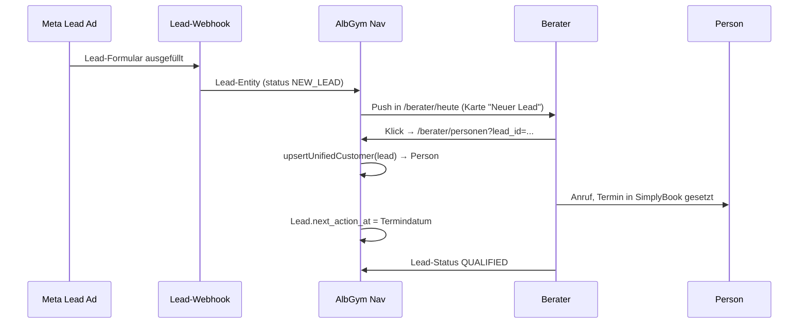

# AlbGym Nav — Navigation & Sitemap

Sprint 0 · UX Architect · 2026-05-22
Quellen: `src/App.jsx`, `src/components/layout/AdvisorLayout.jsx`, `src/pages/*`, `docs/sprint-0/00-product-vision-raw.md`.

---

## 1. Heutige Navigation (Ist-Stand)

### 1.1 Alle Routes (aus `src/App.jsx`)

| Route | Datei:Zeile | Schutz | Funktion |
|---|---|---|---|
| `/` | App.jsx:59 | public | Hero/Landing — zwei Tiles (Training/Rehasport) |
| `/beratung/:type` | App.jsx:60 | public | Konsumenten-Beratungsflow (Neukunde, Rehasport, Upgrade — Typ über URL-Param) |
| `/rehasport` | App.jsx:61 | public | Rehasport-Kundenflow (Selbstbedienung) |
| `/berater/login` | App.jsx:64 | public | Login (Base44) |
| `/berater` | App.jsx:69 | `ProtectedAdvisorRoute` | Redirect → `/berater/dashboard` |
| `/berater/dashboard` | App.jsx:70 | geschützt | `RehasportAdvisorDashboard` (Reha-fokussiert, mit Tabs!) |
| `/berater/rezepte` | App.jsx:71 | geschützt | `PrescriptionIntake` (Rezept-Upload + OCR) |
| `/berater/leads` | App.jsx:72 | geschützt | `LeadCockpit` (Pipeline) |
| `/berater/personen` | App.jsx:73 | geschützt | `PersonenCockpit` (Phase 3 neu, Karten-View) |
| `/berater/kunden` | App.jsx:74 | geschützt | `CustomerList` (alte CRM-Liste) |
| `/berater/leistungen` | App.jsx:75 | geschützt | `ServiceCatalog` (Admin) |
| `/berater/tarife` | App.jsx:76 | geschützt | `TariffList` (Admin) |
| `/berater/baukasten` | App.jsx:77 | geschützt | `TariffBuilder` (nicht in Sidebar!) |
| `/berater/verlauf` | App.jsx:78 | geschützt | `ConsultationHistory` |
| `/berater/analytics` | App.jsx:79 | geschützt | `Analytics` (Admin) |
| `/berater/admin` | App.jsx:80 | geschützt | `Admin` (Admin-Hub) |
| `/berater/regeln` | App.jsx:81 | geschützt | `RulesAdmin` (Admin) |

### 1.2 Rollen-Schutz: wie?

- Eine Schutz-Ebene: `ProtectedAdvisorRoute` (`src/components/auth/ProtectedAdvisorRoute.jsx:7-67`) checkt `hasAdvisorAccess(user)`.
- Erlaubte Rollen (`src/lib/advisorAccess.js:1-10`): `admin · administrator · berater · advisor · trainer · coach · service · sales`.
- **Konsequenz: ALLE eingeloggten Rollen sehen ALLE Berater-Routes.** Es gibt keine rollenbasierte Filterung im Layout. Ein Trainer sieht heute Admin, Leistungen, Tarife, Regeln genauso wie Studioleitung.

### 1.3 Inkonsistenzen / tote Routes

| Befund | Beleg | Problem |
|---|---|---|
| Sidebar zeigt 11 Items, App-Router kennt 13 Routes | AdvisorLayout.jsx:21-33 vs. App.jsx:69-82 | `/berater/baukasten` (TariffBuilder) hat keinen Sidebar-Eintrag, `/berater` als Redirect-Root auch nicht (ok). |
| Dashboard-Route ist Reha-Tab-Dashboard | App.jsx:70 → `RehasportAdvisorDashboard` | Default-Landing für **alle** Berater ist eine Rehasport-spezifische Tab-Page mit 7 Reha-Tabs (Reha-Kunden/Krankenkassen/Reha-Analytics/Reha-Tarife/Leistungen/Reha-Admin). Trainer landet hier auf falschem Bild. Studioleitung sieht hier nicht Studio-Metriken. |
| `Dashboard.jsx` existiert, wird aber nicht geroutet | `src/pages/Dashboard.jsx` ist verwaist | Generisches Berater-Dashboard mit Hauptaktionen "Neukunden-Beratung/Rehasport-Beratung/Bestandskunden-Upgrade" — nirgends verlinkt. Diese Datei sollte entweder gelöscht oder als neues Berater-Heute wiederbelebt werden. |
| Sidebar-Link "Zur App" zeigt Pfeil zurück, aber Berater ist eingeloggt im Admin-Bereich | AdvisorLayout.jsx:44-47 | Verwirrend: ein eingeloggter Studioleiter klickt "Zur App" und landet auf der Public-Hero. Semantik unklar — ist das ein "Logout-Light"? |
| Reha-Kontext doppelt | Sidebar "Rezepte" (App.jsx:71) + Dashboard-Tab "Reha-Kunden" + eigene Reha-Flows | Charter §54 fordert "Rehasport kein isolierter Menüpunkt, sondern in Personenakte". Heute ist Rehasport eine **eigene Sektion mit eigenem Dashboard mit eigenen Tabs**. Direkt-Konflikt mit Vision. |
| Kein Rollen-Switching möglich | — | Studioleiter und Trainer und Berater haben dieselbe Navigation. Charter fordert getrennte Welten Management/Trainer/Berater/Kunde — heute existiert nur "Berater". |
| Tarif-Baukasten orphan | App.jsx:77 ohne Sidebar-Eintrag | Erreichbar nur via direktem Link/Edit-Button aus TariffList — UX-Bruch wenn Studioleiter direkt zu Baukasten will. |

### 1.4 Was es heute NICHT gibt (Charter fordert es aber)

- Trainer-Welt: kein `/trainer/*` Namespace.
- Management-Welt: kein `/management/*` Namespace. Alles liegt unter `/berater/*` — semantisch falsch.
- Mitarbeiterverwaltung: keine Route, kein Employee-Entity sichtbar in App.jsx.
- Arbeitspläne / Schichten: keine Route.
- Kurse: keine Route.
- Krankmeldung Trainer: keine Route.
- Personenakte Detail (`/personen/:id`): existiert nicht, `PersonenCockpit:309-313` zeigt nur Toast "Detailansicht folgt in Phase 5".

---

## 2. Soll-Navigation: Rollenbasiert

Empfehlung: **drei Berater-Namespaces ablösen** durch vier Welten. URL-Präfix = Rolle.

### 2.1 Studioleitung / Admin → `/management/*`

```
/management
  /uebersicht           Studio-KPIs, offene Konflikte (Sync/Daten), Tagesfokus
  /mitarbeiter          Liste, Rollen, Fähigkeiten (Employee-Entity)
  /arbeitsplaene        Schichten, Wochenraster (NICHT MVP1)
  /kurse                Kurs-Katalog (NICHT MVP1)
  /leistungen           ServiceCatalog (heute /berater/leistungen)
  /tarife               TariffList + Baukasten (heute /berater/tarife)
  /vertraege            Vertragsverwaltung
  /krankenkassen        HealthInsurance (heute in Admin.jsx)
  /sync                 SyncJob-Übersicht, Readiness-Konflikte
  /regeln               RulesAdmin (heute /berater/regeln)
  /analytics            Analytics (heute /berater/analytics)
```

### 2.2 Berater → `/berater/*`

```
/berater
  /heute                Tagesfokus: neue Leads, fällige Follow-ups, anstehende Termine
  /personen             PersonenCockpit (bleibt — Phase 3 fertig)
  /personen/:id         Personenakte mit Tabs (Kontaktdaten · Ziele · Verträge · Reha · Sync) — NEU
  /leads                LeadCockpit (bleibt)
  /beratung/start       Navigator-Einstieg (Auswahl Kontext: Neukunde/Reha/Upgrade)
  /verlauf              ConsultationHistory (bleibt)
```

**Wichtig:** `/berater/rezepte`, `/berater/leistungen`, `/berater/tarife`, `/berater/regeln`, `/berater/analytics`, `/berater/admin` aus Berater-Sidebar entfernen — gehören in Management. Rezepte werden in Personenakte/Reha-Tab integriert.

### 2.3 Trainer → `/trainer/*`

```
/trainer
  /heute                Heute-Karte: Termine, Aufgaben, Krankmeldungen team
  /aufgaben             Eigene Aufgabenliste
  /meine-kunden         Personen, die dem Trainer zugeordnet sind
  /termine              Wochenkalender
  /krankmeldung         Eigene Krankmeldung einreichen
  /team                 Team-Pinwand / interne Nachrichten (light)
```

Trainer sieht NICHTS aus Management. **Strenge Trennung — Charter No-Go-Regel 4.**

### 2.4 Kunde (Beratungsflow) → `/berate-mich/*` (vorgeschlagen, statt heute `/beratung/:type`)

```
/berate-mich
  /start               Auswahl Kontext (Training/Rehasport/Bestandskunde)
  /ziel                Was möchte ich?
  /lebenssituation     Beruf, Alltag, Sport
  /einschraenkungen    Anamnese, Reha-Hinweise
  /betreuung           Wie viel Begleitung?
  /empfehlung          Vorschlag aus Engine
  /abschluss           Vertragspfad / Termin
```

Heute liegt der Kundenflow unter `/beratung/:type` (App.jsx:60) — funktioniert, sollte aber sprachlich klarer. Alternativ: aktuellen Pfad behalten und nur den Mechanismus umbauen. Entscheidungsfrage 12: Token-basierter Zugriff (Tablet-Übergabe) oder weiterhin offen?

Kunde sieht NIEMALS Sidebar oder Berater-Menü. Eigener Layout ohne `AdvisorLayout`.

---

## 3. Default-Landing pro Rolle

| Rolle | Heute | Soll |
|---|---|---|
| Studioleitung | `/berater/dashboard` (Reha-Tabs!) | `/management/uebersicht` |
| Admin | `/berater/dashboard` | `/management/uebersicht` |
| Berater | `/berater/dashboard` (Reha-Tabs!) | `/berater/heute` |
| Trainer | `/berater/dashboard` (Reha-Tabs!) | `/trainer/heute` |
| Empfang | `/berater/dashboard` | `/berater/personen` (Pers. nachschlagen) |
| Reha-Mitarbeiter | `/berater/dashboard` | `/berater/personen` mit Reha-Filter |
| Kunde | — (im Studio Tablet aufgerufen) | `/berate-mich/start` |

**Beleg Status quo:** `AdvisorLogin.jsx:20` setzt `targetPath = location.state?.from || '/berater/dashboard'` — alle landen auf der **gleichen Reha-Tab-Page**, unabhängig von der Rolle. Das ist UX-Problem #1.

Login muss nach Login die Rolle lesen und auf die passende Welt routen. Empfehlung:

```
post-login:
  if hasRole(STUDIOLEITER|ADMIN)  → /management/uebersicht
  elif hasRole(TRAINER|COACH)     → /trainer/heute
  elif hasRole(BERATER|ADVISOR)   → /berater/heute
  elif hasRole(SERVICE|EMPFANG)   → /berater/personen
  else                            → /access-denied
```

---

## 4. User Journeys (5 Kern-Journeys)

### Journey 1: Neuer Lead aus Meta-Ad → Erstkontakt



Berührte Screens: `/berater/heute` → `/berater/leads` (Detail) → `/berater/personen/:id` (neu).

### Journey 2: Rehasport-Aufnahme (Rezept) — nach Charter umgebaut

Heute: Rezept-Upload ist eigene Seite (`/berater/rezepte`) → falsch laut Charter §54 "kein isolierter Menüpunkt".

Soll-Ablauf:
```
1. Berater öffnet /berater/personen oder /berater/heute
2. Klick "Neue Person aus Rezept" (CTA in PersonenCockpit)
3. Modal/Drawer: Rezept-Foto/PDF Upload
4. OCR-Pipeline (existiert: src/lib/prescription/*) füllt Felder vor
5. Berater prüft Felder; fehlende rot markiert
6. Krankenkasse-Abgleich (HealthInsurance-Entity)
7. Person anlegen ODER bestehende Person erweitern (existierende Logik)
8. Reha-Kontext in Personenakte → Tab "Reha"
9. PDF speichern, Welcome-Termin-Vorschlag (SimplyBook)
```

Berührte Screens: `/berater/personen` → Drawer "Rezept-Aufnahme" → `/berater/personen/:id?tab=reha`.

### Journey 3: Trainer-Tagesstart (Mobile)

```
1. Trainer öffnet Tool auf Handy → /trainer/heute
2. Sieht: 3 Termine heute, 2 fällige Aufgaben, 1 Team-Nachricht
3. Klick "Termin 09:00 Müller" → /trainer/meine-kunden/m-mueller
4. Sieht nur trainer-relevante Daten (KEINE Tarif/Vertragsdetails)
5. Notiz hinzufügen → Anhängen an Person via Note-Entity
6. Klick "Krank melden" → /trainer/krankmeldung → Formular → Submit
```

Berührte Screens: `/trainer/heute` → `/trainer/meine-kunden/:id` → `/trainer/krankmeldung`.

### Journey 4: Studioleiter-Wochencheck (Desktop)

```
1. Login → /management/uebersicht
2. Sieht: Wochen-KPIs (neue Leads, Abschlüsse, offene Sync-Konflikte)
3. Roter Badge "Sync-Konflikte: 3" → /management/sync
4. SyncJob-Tabelle: 2 ThemiSoft-Fehler, 1 myYolo-Fehler
5. Klick Konflikt → Detail → "Person reparieren" → /berater/personen/:id (springt Welt, mit Rück-Pfad)
6. Felder gefixt → zurück zu /management/sync → erneut prüfen
```

Berührte Screens: `/management/uebersicht` → `/management/sync` → Cross-World-Link.

### Journey 5: Vertragsabschluss aus Beratung heraus

```
1. Berater startet Beratung → /berater/beratung/start
2. Kundenflow durchgespielt (oder am Tablet vom Kunden ausgefüllt)
3. /berate-mich/empfehlung zeigt Vorschlag aus Engine
4. /berate-mich/abschluss: Tarif gewählt, Signatur (existiert: SignaturePad.jsx)
5. System: ContractDraft erstellt + Lead.status → CONTRACT
6. Berater sieht Folge-Aktion in /berater/heute: "Vertrag prüfen (Müller)"
7. Klick → /berater/personen/:id?tab=vertrag → Vertrag finalisieren
```

---

## 5. Screen-Hierarchie

Drei Ebenen: **Welt → Modul → Detail.**

```mermaid
flowchart TD
  ROOT[/ ]:::pub --> HERO[HeroPage]:::pub
  ROOT --> LOGIN[/berater/login]:::pub
  ROOT --> KFLOW[/berate-mich/*]:::cust

  LOGIN -->|Rolle: Admin/Studioleitung| MGMT[/management]:::mgmt
  LOGIN -->|Rolle: Berater| BER[/berater]:::ber
  LOGIN -->|Rolle: Trainer| TRA[/trainer]:::tra

  MGMT --> M1[/management/uebersicht]:::mgmt
  MGMT --> M2[/management/mitarbeiter]:::mgmt
  MGMT --> M3[/management/leistungen]:::mgmt
  MGMT --> M4[/management/tarife]:::mgmt
  MGMT --> M5[/management/sync]:::mgmt
  MGMT --> M6[/management/regeln]:::mgmt
  MGMT --> M7[/management/analytics]:::mgmt

  BER --> B1[/berater/heute]:::ber
  BER --> B2[/berater/personen]:::ber
  B2 --> BD[/berater/personen/:id]:::ber
  BER --> B3[/berater/leads]:::ber
  BER --> B4[/berater/beratung/start]:::ber
  BER --> B5[/berater/verlauf]:::ber

  TRA --> T1[/trainer/heute]:::tra
  TRA --> T2[/trainer/meine-kunden]:::tra
  TRA --> T3[/trainer/krankmeldung]:::tra

  classDef pub fill:#1a1a1a,stroke:#444,color:#eee
  classDef cust fill:#0a3d1f,stroke:#3aff80,color:#fff
  classDef mgmt fill:#1d2a40,stroke:#5da8ff,color:#fff
  classDef ber fill:#1a2e1a,stroke:#3aff80,color:#fff
  classDef tra fill:#3a2a0d,stroke:#f0b020,color:#fff
```

- **Welt-Ebene**: max 4 (Management / Berater / Trainer / Kunde). Wechselt nur durch Rolle, nicht durch Klick.
- **Modul-Ebene**: 5–10 Items pro Welt in Sidebar.
- **Detail-Ebene**: Personenakte ist das einzige Tab-/Subnav-Modul (Sprint 5).

---

## 6. Sichtbarkeitsregeln (komprimiert)

Tabelle: was wann sichtbar. **Detaillierte Rollenmatrix → siehe `03-rollenmatrix.md` (separate Lieferung).**

| Bereich | Studioleit. | Admin | Berater | Trainer | Empfang | Reha-MA | Kunde |
|---|:-:|:-:|:-:|:-:|:-:|:-:|:-:|
| Management-Welt | x | x | — | — | — | — | — |
| Berater-Welt | x | x | x | — | x | x | — |
| Trainer-Welt | x* | x* | — | x | — | — | — |
| Kunde-Welt (Beratungsflow) | x* | x* | x* | — | x* | x* | x |
| Mitarbeiter-CRUD | x | x | — | — | — | — | — |
| Tarife/Leistungen-CRUD | x | x | — | — | — | — | — |
| Personenakte lesen | x | x | x | (eingeschr.) | x | x | — |
| Personenakte schreiben | x | x | x | — | x* | x | — |
| Reha-Aufnahme | x | x | x | — | — | x | — |
| Beratungsflow starten | x | x | x | — | x | x | x* |
| Sync-Steuerung | x | x | — | — | — | — | — |

x* = lesend / über Quervisit, aber nicht der Default-Workspace.

---

## 7. Konflikt-Analyse: heutige vs. Soll-Navigation

### 7.1 Muss migrieren

| Heute | Soll | Begründung |
|---|---|---|
| `/berater/dashboard` (Reha-Tabs) | aufspalten in `/berater/heute` (NEU) + `/management/uebersicht` (NEU) + `/management/krankenkassen` (NEU) | Reha-Spezialdashboard ist Charter-Konflikt §54. Trainer/Studioleiter haben hier nichts zu suchen. |
| `/berater/rezepte` (`PrescriptionIntake`) | als Drawer/Modal in `/berater/personen` oder `/berater/personen/:id?tab=reha` | Charter §54: "kein isolierter Menüpunkt". |
| `/berater/leistungen`, `/berater/tarife`, `/berater/baukasten`, `/berater/regeln`, `/berater/analytics`, `/berater/admin` | nach `/management/*` umziehen | Rolle Berater darf laut Vision §32-34 keine Adminfunktionen sehen (No-Go-Regel 4). |
| `/berater/kunden` (`CustomerList`) | abschaffen | `PersonenCockpit` (`/berater/personen`) ist der Ersatz; CustomerList ist Phase-2-Legacy. |
| `Dashboard.jsx` (verwaist) | als Basis für `/berater/heute` recyceln oder löschen | Verwirrung beseitigen. |

### 7.2 Bleibt

- `PersonenCockpit.jsx` — UI-Sprache solide, Karten-Layout funktioniert. Pfad bleibt `/berater/personen`.
- `LeadCockpit.jsx` — Pipeline-Logik bleibt, ggf. visuell ans Personen-Cockpit angleichen.
- `ConsultationFlow.jsx` (Kundenflow) — funktional, evtl. nur URL umbenennen `/beratung/:type` → `/berate-mich/:type`.
- `AdvisorLogin.jsx` — funktioniert, post-login-routing erweitern.
- shadcn/ui-Komponenten — alle wiederverwendbar.

### 7.3 Muss neu gebaut werden (Sprint 1–3 Scope)

- `ManagementLayout.jsx` (Sidebar Management)
- `TrainerLayout.jsx` (Sidebar/Bottom-Nav Trainer mobile-first)
- `CustomerLayout.jsx` (Layout-Hülle für Kundenflow ohne Berater-Sidebar — heute hat ConsultationFlow gar keine Layout-Hülle, ist ok, aber wird klarer abgegrenzt)
- `/management/uebersicht` Page
- `/management/mitarbeiter` Page + Employee-Entity-CRUD
- `/management/sync` Page (SyncJob-Übersicht)
- `/berater/heute` Page (Tagesfokus)
- `/berater/personen/:id` Page (Personenakte, Sprint 5)
- `/trainer/heute`, `/trainer/meine-kunden`, `/trainer/krankmeldung` Pages
- Post-Login-Router (`AdvisorLogin.jsx` erweitern)

### 7.4 Konkrete Datei:Zeile-Probleme

- `App.jsx:70` — `RehasportAdvisorDashboard` als Default-Landing für ALLE Rollen ist primärer UX-Konflikt mit Charter.
- `AdvisorLayout.jsx:21-33` — Sidebar zeigt 11 Items ohne Rollen-Filter. Trainer sieht "Admin", "Regeln", "Analytics" — verboten laut Vision §32 + §54 + No-Go 4.
- `AdvisorLogin.jsx:20` — Hardcoded `'/berater/dashboard'` als targetPath. Muss rollenabhängig werden.
- `App.jsx:67-83` — alle geschützten Routes liegen unter `<ProtectedAdvisorRoute>` aber ohne weitere Rollen-Differenzierung. Brauchen rollenbasierte Sub-Routes (`<ProtectedManagementRoute>`, `<ProtectedTrainerRoute>`).
- `Dashboard.jsx` — verwaiste Datei (1-192). Löschen oder als `/berater/heute` recyceln (siehe §1.3).
- `App.jsx:77` (`/berater/baukasten`) — kein Sidebar-Eintrag, Orphan-Route.
- `RehasportAdvisorDashboard.jsx:13-21` — 7 Reha-Tabs als Default-Dashboard zementieren den Charter-Konflikt; Tabs müssen aufgelöst und in Management/Personenakte verteilt werden.

---
